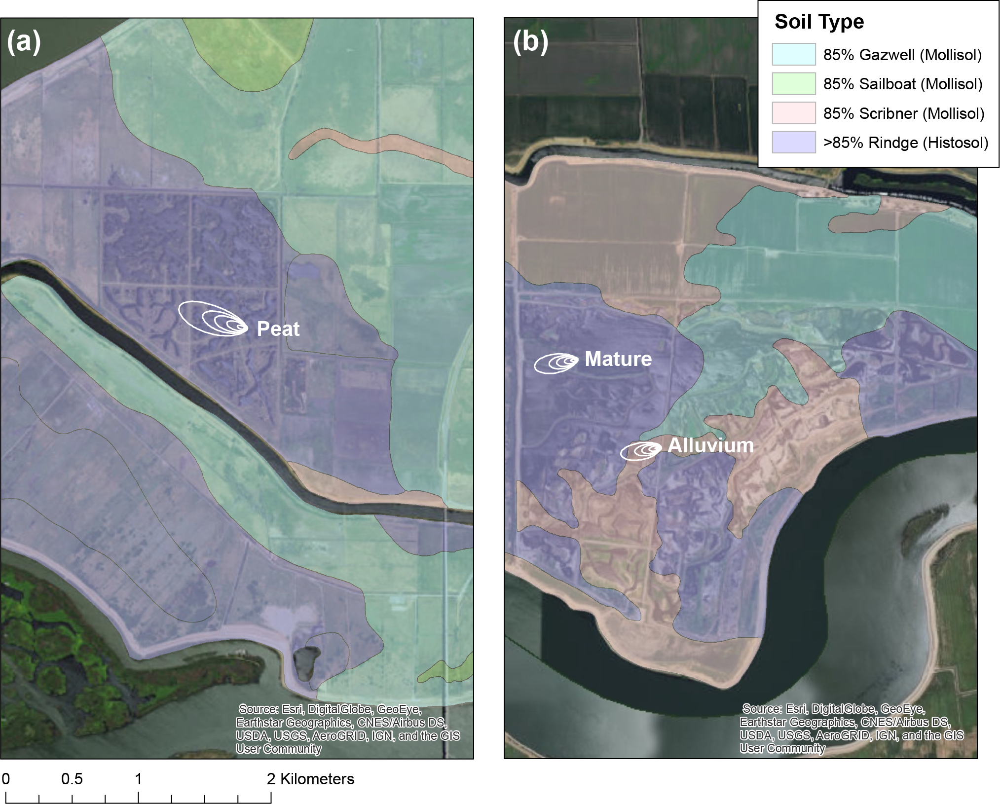

^1^Department of Environmental Science, Policy, and Management, University of California, Berkeley, California USA

^2^Department of Earth and Environmental Sciences, California State University, East Bay, Hayward, California, USA

^3^National Ecological Observatory Network, Boulder, Colorado, USA

^4^U.S. Geological Survey, Menlo Park, California, USA

^5^Department of Biological Sciences, Wellesley College, Wellesley, Massachusetts, USA

**Running Head**:

**Keywords**:

**Type of Paper**: Primary research article

```{r setup, include=FALSE}
#setwd to main package directory
knitr::opts_knit$set(root.dir = normalizePath("../"))

knitr::opts_chunk$set(
  collapse = TRUE,
  comment = "#>")

knitr::opts_chunk$set(echo = TRUE)
```

```{r packages, message=FALSE}
library(knitr)
library(tidyverse)
library(lubridate)
library(gridExtra)
library(scales)
library(zoo)
```

\newpage
## Abstract

## Introduction
The Delta region is currently comprised of a network of artificially drained islands reclaimed for agriculture, where the water table is maintained below sea level through active pumping and levees surrounding each island. Drainage began in the 1850's to facilitate agricultural development, and exposure of the highly organic soils has led to substaintial CO~2~ emissions [@hatala2012greenhouse, @knox2015agricultural] and land surface subsidence [@deverel2010historic]. Prior to drainage, this region was a 5 billion m^3^ tidal marsh where soil type and organic matter varied substantially over small spatial scales [@deverel2010historic]. A major driver of this soil variation is fluvial deposition from major rivers, such as the Sacramento river, which would carry mineral alluvium from the Sierra Nevada range [@deverel2010historic]. Alluvium soils are more common in islands adjacent to the Sacramento River, as compared to the central and eastern Delta region where fluvial deposition was less pronounced  [@deverel2010historic]. As result, central and eastern Delta islands are typically less heterogeneous and higher carbon than islands adjacent to the Sacramento River drainage [@deverel2010historic].

## Materials and Methods
### Site Description
We measured wetland ecosystem fluxes of CH~4~, CO~2~, H~2~O, and sensible heat using a network of eddy covariance towers in the Sacramento-San Joaquin Delta region of California, USA.  The region is located within a Mediterranean climate that experiences hot, dry summers and cooler, rainy winters. The mean annual temperature is 15.1$^\circ$C (1998-2015 average), and the region receives 326 mm of rainfall annually [@knox2016biophysical]. All measurement sites were located on Sherman and Twichell islands in the northwest Delta region. Both islands are adjacent to the Sacramento River and have typically lower carbon soils than islands within the central and eastern Delta surrounding tributaries of the San Joaquin River [@deverel2010historic]. Both islands are a mosaic of alluvium mollisols and deep histosols [@soilsurvey]. The alluvium mollisols  likely formed via fluvial deposition from major rivers, and histosols formed densely organic soils in areas less disturbed by fluvial input [@deverel2010historic]. On these islands the dominant mollisol series are Gazwell and Scribner (Fig. 1), both of which are formed in mixed alluvium, belong to the soil class Cumulic Endoaquolls, and are found only on Delta islands within the Sacramento River drainage [@soilsurvey]. Rindge is the major histosol series found on both islands (Fig. 1) and is widely distributed across the Delta region. Rindge soils belong to the  Typic Haplosaprists class, and are characterized by deep and poorly drained organic soils formed in marshes from decomposed plant organic matter [@soilsurvey]. 

Wetland ecosystem fluxes have been measured for over three years from one wetland restored on Scribner series and two wetlands restored on Rindge series (Fig. 1). The Rindge series site on Sherman Island (Ameriflux site Us-Myb; N 38.0498, W 121.7650), hereafter referred to as the young peat site, was restored from a former pasture in October 2010, and ecosystem flux measurement began at this time. The Rindge series site on Twichell Island (Ameriflux site Us-Tw1; N 38.1074, W 121.6469), hereafter referred to as the old peat site, was restored from a degraded agricultural site in 1997 and ecosystem flux measurements began in July 2012. The Scribner series site on Twitchell Island (Ameriflux site US-Tw4; N 38.10275, W 121.64125), hereafter referred to as the alluvium site, was restored in January 2014 on a former corn field and ecosystem flux measurements began at this time. All sites are vegetated with a mix of cattails (*Typha* spp.) and tules (*Schoenoplectus acutus*) and are actively managed to remain inundated year-round. Both the young peat and alluvium sites were constructed to have heterogenous bathymetry, providing channels of open water and areas of closed vegetation. The old peat site is entirely closed vegeation and the ground surface is saturated tule and cattail detritus, whereas the newly restored young peat and alluvium sites have standing water under the plant canopy as peat accumulation is less than the old site. For a more detailed description the young and old peat sites see @miller2011carbon, @matthes2014parsing, and @knox2015agricultural.



### Ecosystem Flux Measurements
Fluxes of CH~4~, CO~2~, H~2~O, and sensible heat from the restored wetland were measured by eddy covariance. We measured three-dimensional wind speed and direction using sonic anemometers (WindMaster Pro, Gill Instruments, Hampshire, UK) and CH~4~, CO~2~, and H~2~O concentrations using open-path infrared gas analyzers (LI-7500A and LI-7700, LI-COR Inc., Lincoln, Nebraska, USA) at 20 Hz interval, and all high-frequency data were logged to LI-7550 dataloggers (LI-COR Inc., Lincoln, Nebraska, USA). Corrections were applied vertical wind speed data prior to flux processing for WindMaster Pro's affected by the 'w bug' that causes an underestimate in vertical wind speeds. Half-hourly fluxes were then calculated using in-house MATLAB software [@detto2010scaling, @hatala2012greenhouse, @knox2015agricultural], and flux corrections and quality control were applied as described in detail in @knox2015agricultural and @chamberlain2017evaluation.


## Results


